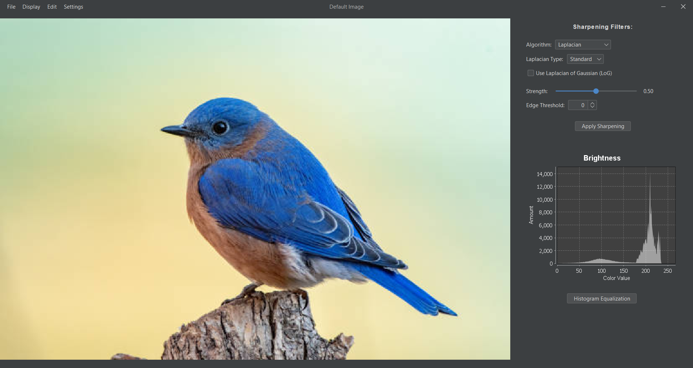
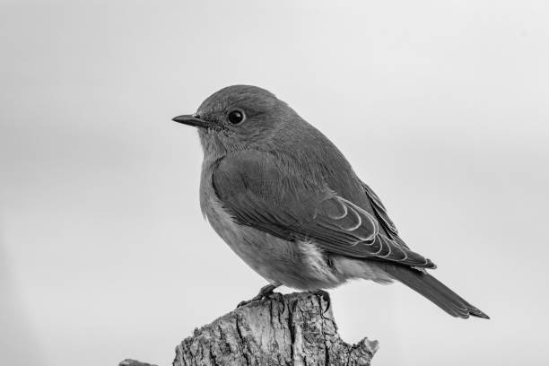
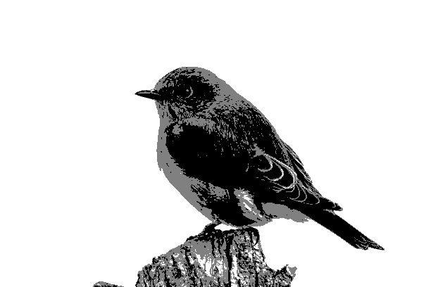
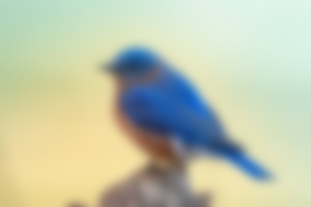
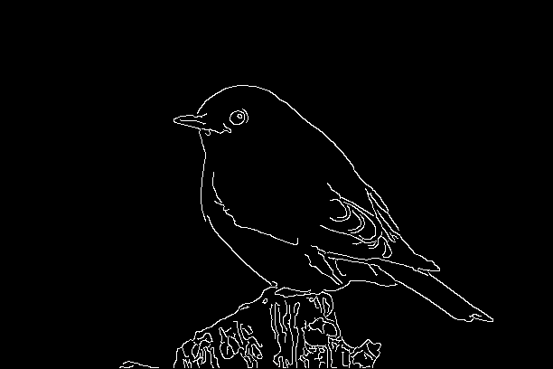

# Image processing app

The project is a desktop application implemented in Java made for the Biometrics course during the sixth semester (2025/2026) at the Warsaw University of Technology. Our image-processing application supports a range of operations on imported images. It allows users to perform grayscaling, binarization, brightness and contrast adjustments, alongside graphic filters for blurring, sharpening, and edge detection -all utilizing various algorithms. The software supports morphological operations, image inversion, and histogram equalization. Apart from that, it displays real-time brightness histograms and spatial projections. After applying the chosen modifications, the processed image can be easily exported and saved locally. Full documentation is available in the [Documentation.pdf](Documentation.pdf) file.

# App UI

# Available functionalities

- **Importing and saving images**
- **Displaying brightness and RGB histograms**
- **Histogram equalization**
- **Displaying vertical and horizontal projections**
- **Applying various pixel operations**
- **Using graphic filters**
- **Executing morphology operations**

# Pixel operations

**Grayscaling** is available using one of the six algorithms - averaging, luminance, desaturation, decomposition, single color channel, custom and custom with dithering. Below is an image grayscaled using luminance.

**Negative** allows for turning the image into a negative.

**Brightness** panel offers shifting overall brightness of the image or changing its range.

**Contrast** panel offers gamma and log contrast corrections. Below is an image after gamma correction with $\alpha=0.6$.

**Binarization** is available through six segmentation algorithms - Otsu, Niblack, Bernsen, multi-Otsu, custom multi-threshold and custom threshold. Below is an image after multi-Otsu binarization with 3 gray classes.

# Graphic filters

**Blurring** is available through either a simple Box Blur or Gaussian Blur; the image below has been modified using Gaussian Blur with $\sigma=10$.

**Sharpening** can be done using either Laplacian-based sharpening or Unsharp Masking; the image below is a result of Unsharp Masking with $\sigma=2$, $s=1$, $T=20$.

**Edge Detection** can be done using Laplace operator, 2-directional Sobel or Roberts Cross operators, 8-directional Sobel Compass or Prewitt Compass operators, and the Canny Algorithm. The image below is a result of the Canny Edge Detection.

In this section, the user can also input their own **Custom Mask**. 

# Morphology operations

There are four available morphology operations - **erosion, dilation, opening** and **closing**. The image below shows the usage of erosion using a 3x3 square structuring element.

---
### Authors

- [Martyna Sadowska](https://github.com/Martyna-265)
- [Hanna Szczerbińska](https://github.com/zabolot7)